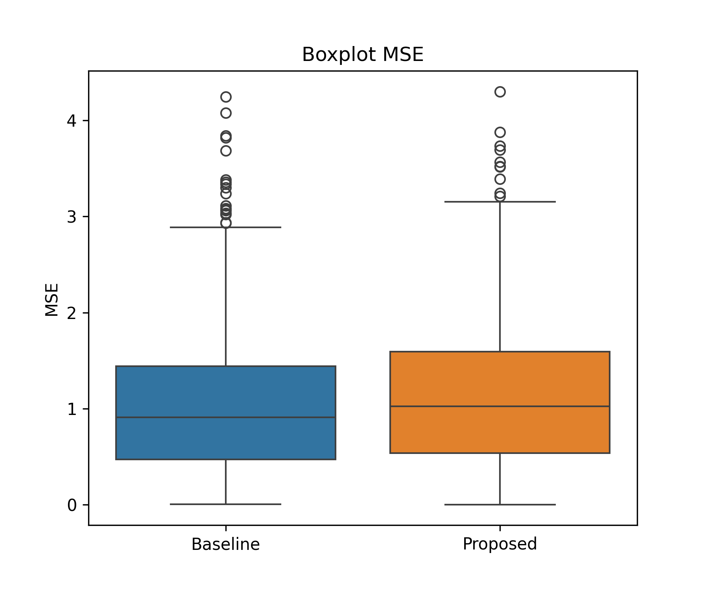
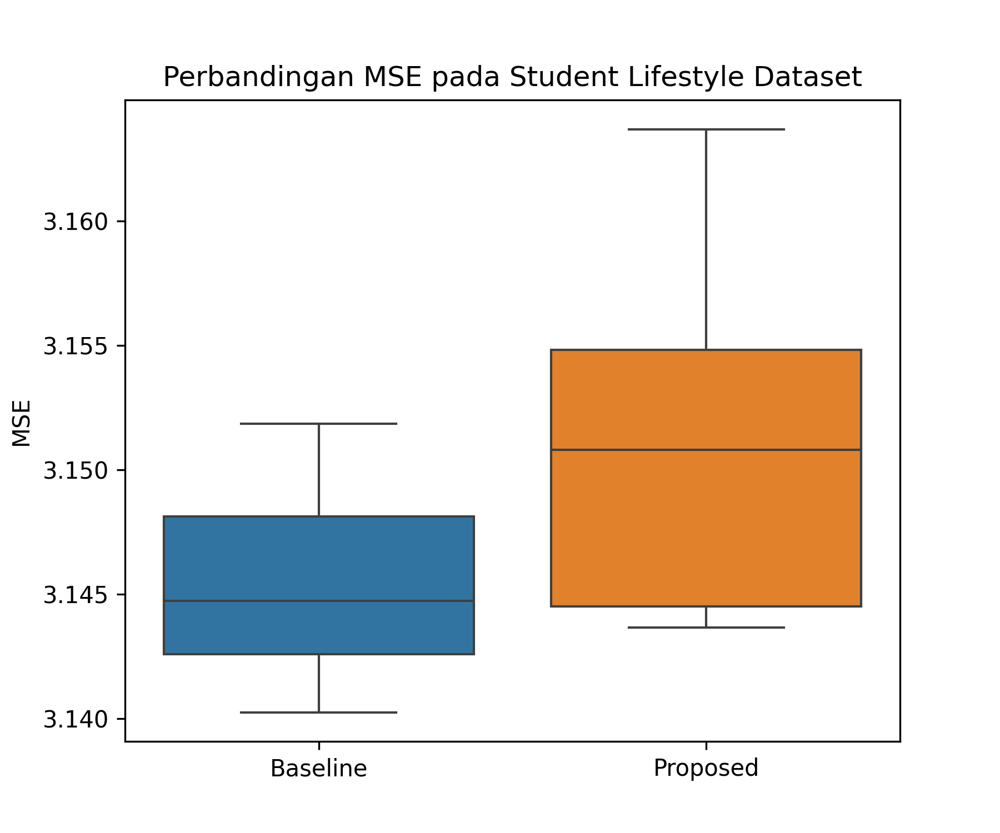

[](https://python.org)
[](https://pytorch.org)
[](LICENSE)
[](https://thesis-inertia-lstm-reset-egxkzkd5ogtkekwj7jxgs9.streamlit.app/)

# Periodic Partial Reset on LSTM for Concept Drift in Stress Prediction

> **Research project for MSc Data Science** – ITB STIKOM Bali (pre‑admission portfolio)

This repository implements **periodic partial reset** on LSTM to improve adaptation to **sudden concept drift** in time‑series stress prediction. Inspired by Newton’s law of inertia and psychological inertia, the method randomly resets **3% of weights every 15 epochs**.

## 🎯 Key Results

| Dataset | Baseline MSE | Proposed MSE | Improvement | p‑value | Effect Size |
|:--------|-------------:|-------------:|------------:|--------:|:------------|
| **Synthetic** (sudden drift, 42 iters) | 1.0203 | **0.2730** | **73.24%** | **<0.001** | Cohen's d = 2.34 |
| **Student Lifestyle** (real, 10 iters) | 3.1456 | 3.1510 | -0.17% | 0.0245 | – |

> ✅ **Major finding:** Periodic partial reset significantly reduces MSE (73%, p<0.001) on synthetic data with sudden drift.  
> ⚠️ On the real Student Lifestyle dataset, the method does not improve performance, highlighting the need for per‑dataset parameter tuning.

## 🗂️ Repository Structure

```
thesis-inertia-lstm-reset/
├── data/                     # (optional) dataset files
├── experiments/              # main experiment scripts
│   ├── main_tesis.py         # synthetic data experiment (main result)
│   └── main_real_student.py  # real‑data validation (Student Lifestyle)
├── src/                      # core modules
│   ├── data_generator.py     # synthetic data generation (sudden drift)
│   ├── model.py              # LSTM + periodic reset logic
│   └── preprocessing.py      # real‑data loader and mapper
├── dashboard/                # Streamlit interactive dashboard
│   └── app.py
├── results/                  # output CSV and plots
│   ├── boxplot_tesis.png
│   └── boxplot_real_data.png
├── thesis/                   # thesis document (PDF)
├── requirements.txt          # Python dependencies
├── .gitignore
└── README.md
```

## 🚀 Getting Started

### 1. Clone the repository

```bash
git clone https://github.com/afuckingco/thesis-inertia-lstm-reset.git
cd thesis-inertia-lstm-reset
```

### 2. Create a virtual environment and install dependencies

```bash
python -m venv venv
source venv/bin/activate   # Linux/Mac
# or
venv\Scripts\activate       # Windows

pip install -r requirements.txt
```

### 3. Run the main synthetic experiment

```bash
cd experiments
python main_tesis.py
```

This runs 42 iterations (714 subject‑samples) and produces:
- `../results/tesis_results.csv` (MSE values)
- `../results/boxplot_tesis.png` (comparison boxplot)

### 4. Run the real‑data validation (Student Lifestyle dataset)

```bash
cd experiments
python main_real_student.py
```

Make sure you have downloaded the dataset from [Kaggle](https://www.kaggle.com/datasets/steve1215rogg/student-lifestyle-dataset) and placed `student_lifestyle_dataset.csv` inside the `data/` folder.

### 5. Launch the interactive dashboard

```bash
streamlit run dashboard/app.py
```

The dashboard lets you:
- Generate synthetic data or upload your own CSV
- Adjust reset ratio and frequency
- Compare baseline vs proposed predictions in real time

## 📈 Visual Results

| Synthetic data (sudden drift) | Student Lifestyle (real) |
|:------------------------------:|:-------------------------:|
|  |  |

*Proposed model (orange) yields much lower MSE on synthetic data. On real data, both models perform similarly.*

## 🧠 Key Parameters

| Parameter | Value | Rationale |
|:----------|------:|:----------|
| Reset ratio | 3% | Small enough to avoid catastrophic forgetting, large enough to escape local minima |
| Reset frequency | every 15 epochs | One reset in a 20‑epoch training, giving time to adapt afterward |
| LSTM hidden size | 32 | Lightweight, runs on CPU laptop |
| Window size | 5 days | Uses one week of past data (excluding weekend) |

## 🌐 Live Demo

Try the interactive dashboard online:  
[](https://thesis-inertia-lstm-reset-egxkzkd5ogtkekwj7jxgs9.streamlit.app/)

No installation required – just click the badge!

## 📜 License

This project is licensed under the MIT License – see the [LICENSE](LICENSE) file for details.

## 🙏 Acknowledgements

- Inspired by Newton’s law of inertia and Kuppens et al. (2010) on emotional inertia.
- Dataset: Student Lifestyle Dataset from Kaggle (steve1215rogg/student-lifestyle-dataset).
- Thanks to the open‑source community for PyTorch, Streamlit, and River.

---

**📧 Contact**  
For questions or collaboration opportunities, please open an issue on GitHub.
```

**Cara menggunakannya:**
1. Buka repositori GitHub Anda: `https://github.com/afuckingco/thesis-inertia-lstm-reset`
2. Klik file `README.md`
3. Klik ikon pensil (✏️) untuk edit
4. Hapus semua konten lama, lalu paste kode di atas
5. Klik **Commit changes** (hijau)

Setelah itu, halaman utama repositori Anda akan menampilkan README yang rapi, lengkap dengan badge, tabel, struktur folder, gambar, dan tautan dashboard. Selamat! 🚀
